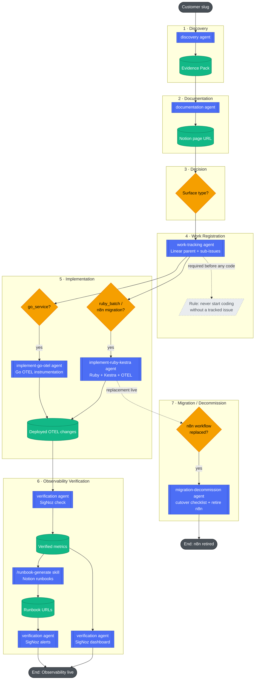

Customer incidents often started the same way: someone noticed missing data in the middle of the night, and nobody knew exactly which integration owned that flow. The immediate reaction was always to ask around until we found one of the few engineers familiar with that customer.

Some integrations lived in Go services, others were n8n workflows, Python scripts, and other were Ruby services. Documentation was inconsistent because it was either half-baked or completely nonexistent. If often lacked details about how an integration was running, whether it was scheduled through cron or Kestra, or whether it was a long-running service serving HTTP endpoints for external calls.

The engineers who had originally built many of them had left the company.

The problem wasn't writing documentation. It was discovering what should be documented.

## Why not RAG?

Retrieval-Augmented Generation (RAG) was an option, but it solved a different problem. I didn't need conversational search or semantic retrieval.

I wanted a structured document for each customer, listing their integrations and covering the following topics:

- Linked to specific customer so everyone can easily share it;
- A simple integration catalog (with basic information such as the execution schedule, input/output of each integration, and other useful details);
- A list of the runbooks for each alert an integration can trigger, helping during incidents;
- If a customer churns, we know the full integration surface and can turn everything off;
- Everything must be a reviewable artifact.

The workflow consisted of several repeatable stages with clear inputs and outputs, so agents and skills were a better approach for tackling this problem:

- discover the integrations;
- identify their schedules;
- update the documentation;
- create issues to add observability and/or migrate any no-code integration to a reviewable repository.

Traditional automation (think shell, Python or other types of scripts) works well when inputs and outputs are known ahead of time. In this case, discovery required interpreting inconsistent repository structures, naming conventions, deployment configurations, and documentation spread across multiple systems. The deterministic parts (calling CLIs, parsing YAML, querying APIs) were implemented as skills, while the LLM was used only where interpretation was required.

## The architecture

### Agents

Initially, I considered using a single agent responsible for discovery, documentation, and implementation.

I rejected that approach because:

- prompts became harder to maintain;
- failures were more difficult to retry;
- context windows grew too large;
- changing the documentation risked affecting discovery;
- responsibilities became blurry.

Instead, I developed the agents so that each had a single responsibility and specialized in a specific task.

Splitting the workflow into independent stages also simplified operations. Since each agent consumed and produced well-defined artifacts, failures could be retried from the affected stage without repeating the entire discovery process. That made experimentation easier and reduced the cost of evolving individual components.

I found that the following agents were needed:

#### discovery

This agent wasn't expected to produce truth. Instead, it produces evidence that integrations are associated with a customer and creates an evidence pack.

The evidence pack is a YAML file that is:

- machine-readable;
- human-reviewable;
- versionable;
- deterministic;
- an intermediate contract.

YAML was chosen because we needed a middle ground between what was implemented and what was documented. More importantly, it served as an explicit contract that decoupled discovery from documentation. We could improve either stage independently without changing the other. Every part of the documentation could be traced back to the YAML and, therefore, to the underlying implementation.

Every conclusion in the evidence pack is backed by the evidence that led to it. Rather than asking reviewers to trust the agent, the system exposes the artifacts it used so engineers can validate or challenge its reasoning. It also became a natural checkpoint. If a downstream stage failed or changed, we could rerun only that stage instead of repeating the entire discovery process.

More importantly, the evidence pack wasn't just an intermediate data format. It was designed to make the discovery process traceable. Every finding included the repository, version control system, and artifact that led to the conclusion, allowing engineers to verify the evidence instead of treating the agent's output as a black box.

The evidence pack became the contract between every stage of the pipeline.

Every downstream step assumed the evidence pack could be incomplete. The agent left open questions whenever it couldn't determine an answer, because forcing it to provide confident answers could lead to incorrect documentation.

Sometimes the uncertainty required us to disagree with the agent because it identified something as needing migration when it was only relevant for documentation. In those cases, we needed to provide the correct answer and explicitly leave it as is.

A wrong answer with high confidence is significantly more dangerous than an explicit "I don't know".

Those open questions required an engineer to answer them, or they could later be assigned to someone else for investigation.

Discovery combined repository inspection, deployment metadata, naming conventions, and infrastructure configuration to build confidence that an integration belonged to a given customer.

#### documentation

Here, the agent reads the evidence pack, applies the documentation template, and produces a Notion page for each customer containing all of its integrations. The resulting page can then be easily shared across the company.

Notion was chosen because it was the company's central knowledge base. There was no reason to reinvent the wheel, although it could easily be replaced with another documentation platform if needed.

#### The rest of the agents: work-tracking, implement-go-otel, implement-ruby-kestra, migration-decommission and verification

- work-tracking: Every engineer guiding the agents should the current stage of the work, then break it down into Linear issues to provide visibility across the company without requiring micromanagement. A PM or any other stakeholder can simply check Linear for progress.
- implement-go-otel: Adds observability to the Go services so issues can be detected.
- implement-ruby-kestra: Migrates the selected n8n workflows to Ruby, adds observability, and schedules them through Kestr.
- migration-decommission: Helps decommission the n8n workflows after they've been migrated to ruby.
- verification: Verifies that everything is complete: PRs have been reviewed and deployed, metrics are flowing into SigNoz, and the related issues can be marked as completed.

All the work performed by the agents is reviewed by a human. We can never be 100% certain about the state of the integrations, and the LLMs can hallucinate or make incorrect inferences, which happened occasionally. More importantly, engineers remain accountable for everything we deliver.

## What surprised me

### Repository organization mattered more than prompts

One of the biggest surprises was that repository organization had a greater impact on the quality of the generated documentation than prompt changes. Consistent naming conventions, clear project structure, and deployment metadata gave the agents reliable signals to reason about. In many cases, improving the engineering ecosystem produced larger gains than refining the prompts.

### Infrastructure became another source of truth

I expected source code to be the primary source of truth. Instead, infrastructure turned out to be equally valuable. Deployment manifests, storage buckets, and scheduled jobs often revealed customer ownership and operational behavior that wasn't obvious from the application code alone.

### Uncertainty was more valuable than confidence

The most useful output wasn't a confident answer, it was a well-defined question.

### Good architecture made agents reusable

Separating discovery from documentation also made the agents reusable. Once discovery produced structured evidence, the same output could support migration planning, observability implementation, and future automation without repeating the discovery process.

### AI as a tool, not a replacement

After a few iterations, I started noticing repetitive situations where the agents either asked how to proceed or repeatedly failed to perform a task the way I wanted. To address that, I introduced a "lessons learned" capability. The agents began recording timestamped lessons at the end of each run, whether from an agent or a skill. When the same lesson applied to two or more discovery, documentation, or migration tasks, it was promoted into the agent's capabilities. This created a form of shared memory that improved consistency over time, allowing both the agents and the engineers using them to benefit from previous experience.

Because we needed to add observability, the agents could also help us choose alerts that would detect issues. Metrics alone aren't useful unless they trigger some action or response. At the end of each observability implementation, we started creating runbooks (documents that help determine wheter an alert requires action) and linking them directly from the alert message. The on-call engineer no longer had to figure out where to start investigating, they could simply click the link and begin.

## What I would improve

If this evolved into a long-lived internal platform, I'd invest in automated evaluation datasets, confidence scoring, and incremental discovery to better measure quality and reduce unnecessary processing.

## Final thoughts

Separating the workflow into independent stages also simplified operations. Since each agent consumed and produced well-defined artifacts, failures could be retried from the affected stage without rerunning the entire pipeline.

Because we needed to collect knowledge about all customer integrations, the goal wasn't to automate engineering decisions.

It was to automate the repetitive work involved in discovering and organizing engineering knowledge.

Along the way, the workflow also identified opportunities to improve existing integrations or create technical debt issues for future work. Finally, adding observability gave us better visibility into how integrations behaved in production, allowing the team to detect problems before customers reported them.

Before building the system, documenting a single customer typically required two engineers to spend roughly two and a half weeks tracing integrations across repositories, workflows, and deployment configurations.

After building it, most of that effort shifted from discovery to validation. Engineers spent their time reviewing evidence and making decisions instead of searching for information.

Looking back, the most valuable parts of the system weren't the prompts or even the LLM. They were the architectural decisions around explicit contracts, traceable evidence, and keeping humans responsible for validating the results. Those choices made the system easier to trust, evolve, and maintain long after the initial implementation.

The bus factor isn't just about people leaving. It's about organizations losing the ability to understand and evolve their own systems. While AI helped reduce that risk in this project, the real value came from treating engineering knowledge as something that could be systematically discover, review, and maintain rather than something that existed only in a few people's heads.
