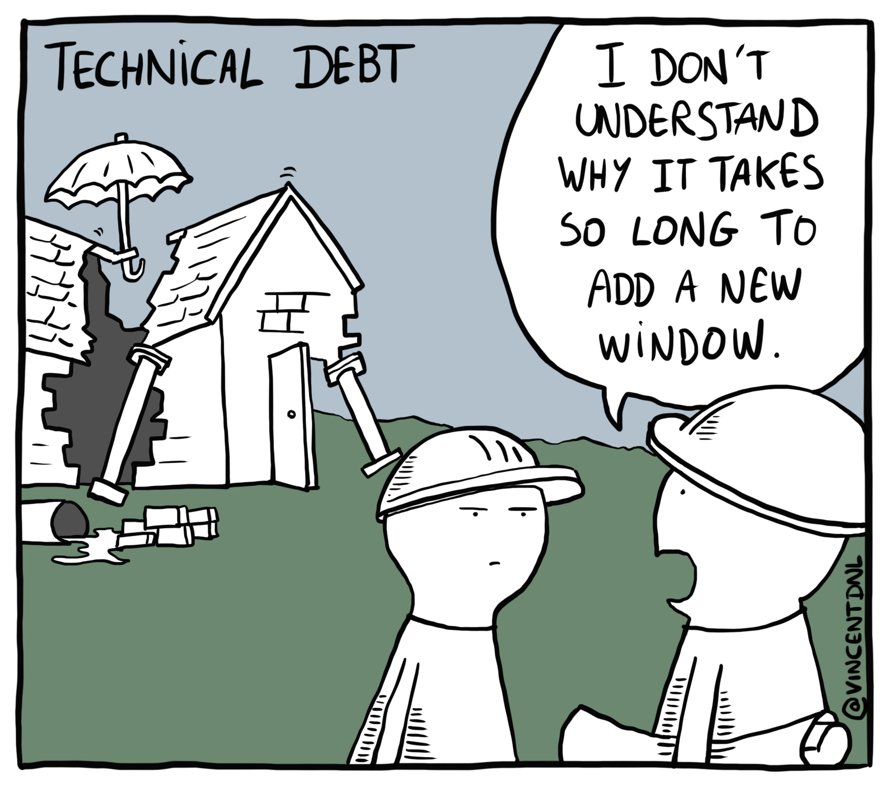

At this post I'll talk about a funny connotation which I've made about software deliverable[^1], our
expectations with customer and the maintenance cost after that.

## The connotation

- A customer wants a double burger, the product owner doesn't know yet what the customer wants but
  shout "Start heating the grill up and put a Grilled ham and cheese";
- The customer when receive the deliverable (the Grilled ham and cheese), he'll be insatisfied,
  because he wants a double burger;
- To revert this issue, the product owner puts a salad and promise a new deadline to deliver a
  double burger;
- But the structure for the customer needs are for the first meal.

## Software project

At software projects, we're facing situations like the connotation above. A customer wants a small
change or request, not so small at the majority of requests, to avoid lose a customer, tries to
embrace the request and the final piece at some times is bad defined and with a tight deadline.

The bad definition per se causes a lot of trouble, because when a developer convert the rules into
code, probably the side effects wasn't measured or known and most of the time it's a waste of time.

Another problem to this "simple requests" is the poor design (here, design is about all the layers
needed to deliver the request, from UX to frontend, backend and infrastructure to solve). But, why
are there a poor design with so "simple requests"? Because, we're defining the deliverable to be a
"Grilled ham and cheese" and not a double burger, the structure will be a lot simpler, tied and will
struggle to evolve.

## Customer expectation

The customer itself doesn't compreheend what he want clearly, but certainly he don't want any
features (e.g. a salad) delivered to disguise the main request and even less a new deadline.

Because of all the misunderstanding about the request and the unhappy customer, the deadline
proposed was tight and the request again, delivered after time with a bad experience (bugs, slow and
other sort of issues). And the customer will be "content" with that, until he goes away.

## Maintenance cost

The maintenance cost probably will be high, because now the product has a new feature which doesn't
satisfying the customer who requested it, the product team must support it, costing time from all
the peers involved. Any time someone wants to fix or improve the feature, he/she will spend more
time and more time to figure out what is going on.

<Caption>
  <a href="https://vincentdnl.com/drawings/technical-debt" target="_blank" rel="noopener noreferrer">
    Technical Debit - Image from Vincent Deniel
  </a>
</Caption>

Maybe a full rewrite and talk to the customer is more appropriate than patch up a thing which born
broken and faulty, there are a lot of technical debts that a small change could even causes more
trouble. A full rewrite resolve most of them, but is has some cost and delay other deliveries too,
the previous "fast" move to keep the customer happy add an extra step to evolve with their debts.

## Conclusion

Sometimes it's better to say no to a customer and reject a request on a software development
world, to say yes and deliver a mislead or broken feature. Therefore, with more plan and analysis is
far better to deliver even a small but more robust, correct, focused customer deliverable with room
to grow is better and avoid trouble.

[^1]: [https://en.wikipedia.org/wiki/Deliverable](https://en.wikipedia.org/wiki/Deliverable)
