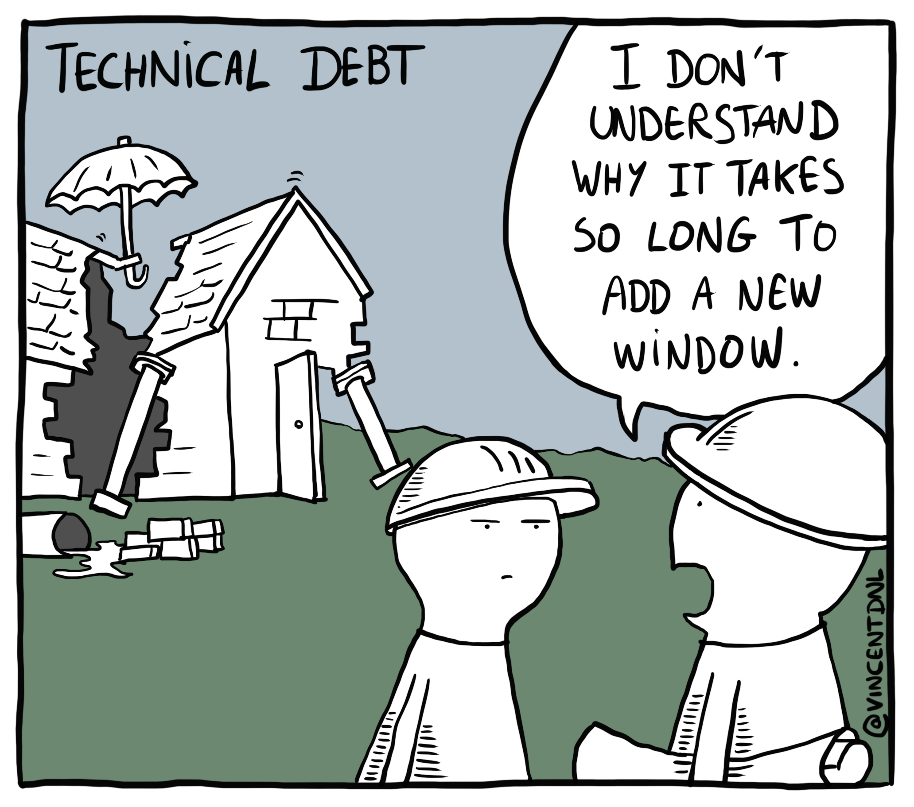

In this post, I'll talk about a funny connotation I made about software deliverables[^1], our
expectations with customers, and the maintenance cost after that.

## The connotation

- A customer wants a double burger. The product owner doesn't know yet what the customer wants but
  shouts, "Start heating the grill up and make a grilled ham and cheese";
- When the customer receives the deliverable (the grilled ham and cheese), he'll be dissatisfied,
  because he wants a double burger;
- To revert this issue, the product owner adds a salad and promises a new deadline to deliver a
  double burger;
- But the structure for the customer's needs is still for the first meal.

## Software project

In software projects, we face situations like the connotation above. A customer asks for a small
change or request (often not so small). To avoid losing a customer, teams try to
embrace the request, and the final piece is sometimes badly defined and delivered with a tight deadline.

A bad definition per se causes a lot of trouble, because when a developer converts the rules into
code, the side effects were probably not measured or known, and most of the time it's a waste of time.

Another problem with these "simple requests" is poor design (here, design is about all the layers
needed to deliver the request, from UX to frontend, backend and infrastructure to solve). But, why
is there poor design with such "simple requests"? Because we're defining the deliverable as a
"Grilled ham and cheese" and not a double burger, the structure will be a lot simpler, tied and will
struggle to evolve.

## Customer expectation

The customer doesn't comprehend exactly what he wants, but certainly he doesn't want
features (e.g. a salad) delivered to disguise the main request, and certainly not another deadline.

Because of all the misunderstanding about the request and the unhappy customer, the deadline
proposed was tight and the request was, again, delivered late with a bad experience (bugs, slowness, and
other sort of issues). And the customer will be "content" with that, until he goes away.

## Maintenance cost

The maintenance cost will probably be high, because now the product has a new feature that doesn't
satisfy the customer who requested it, and the product team must support it, costing time from all
the peers involved. Any time someone wants to fix or improve the feature, they will spend more
time and more time to figure out what is going on.

<figure>

<figcaption class='flex flex-row items-center justify-center text-gray-700 text-sm'>
  <a href="https://vincentdnl.com/drawings/technical-debt" target="_blank" rel="noopener noreferrer">Technical Debit - Image from Vincent Deniel</a>
</figcaption>
</figure>

Maybe a full rewrite and a conversation with the customer is more appropriate than patching up something that was born
broken and faulty. The project now carries a lot of technical debt, and a small change could even cause more
trouble. A full rewrite resolves most of it, but it has some cost and delays other deliveries too.
The previous "fast" move to keep the customer happy added an extra step when evolving the product.

## Conclusion

Sometimes it's better to say no to a customer and reject a request in the software development
world than to say yes and deliver a misleading or broken feature. Therefore, with better planning and analysis, it is
far better to deliver even a small but more robust, correct, and focused customer deliverable with room
to grow, avoiding trouble.

[^1]: [https://en.wikipedia.org/wiki/Deliverable](https://en.wikipedia.org/wiki/Deliverable)
