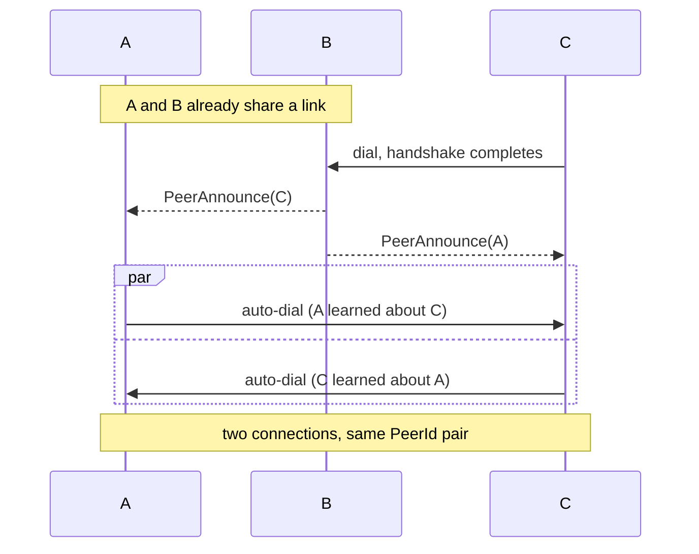

[My last post](/blog/optimizing-19-million-rows-pipeline-without-rewriting-it) was about making a 19 million row pipeline fast without rewriting it, working inside a system nobody had really designed. This one is the opposite setting: a system I control completely, where every decision is mine to make deliberately, one at a time, because learning is the entire point.

[thoth-mesh](https://github.com/brunoarueira/thoth-mesh) is a federated publish/subscribe system I am building as a deliberate learning vehicle for going deep on Rust: async networking, concurrency, protocol design, and distributed systems. It is a Cargo workspace of several crates; the one that matters for this post is the federation and peer-discovery layer, the piece responsible for finding and connecting to other nodes in the mesh. It is pre-1.0, every crate is still 0.x, and the wire protocol and public APIs are explicitly marked unstable. It is a real, working system with real decisions behind it, but it is a learning project, not something you should run in production.

This post is about one of those decisions: dynamic peer discovery via gossip[^1], the duplicate-dial race it creates, and how I resolved it without adding a coordinator.

## What gossip discovery buys, and what it breaks

Before this change, a node's topology was whatever you configured. It dialed the exact addresses passed via `--peer` and nothing else. Message *routing* was already multi-hop, so a publish on one node reached a subscriber anywhere in the mesh through some path, but the set of direct links never grew on its own. A node never learned that its peer had other peers.

Gossip discovery closes that gap. When a peer link completes its handshake, each side records the other in a `PeerDirectory` and sends a catch-up `PeerAnnounce` listing every other dialable peer it already knows about. Every genuinely new peer learned this way gets broadcast onward to every other active link. The mechanism is unconditional flood-fill[^2]: tell every neighbor, and let each one decide independently whether to pass it on. Left unchecked, that would echo forever: nodes re-announcing what they just heard back at each other. Termination depends on a single idempotency gate: only broadcast a peer onward the first time you hear about it.

```rust
/// Records `peer_id` as dialable at `listen_addr`. Returns `true`
/// only the first time this `peer_id` is recorded; a later call
/// still refreshes the address, but returns `false`.
pub fn record(&self, peer_id: PeerId, listen_addr: String) -> bool
```

A `PeerAnnounce` is only re-broadcast when `record` reports the peer as new. Mention the same peer again, from any neighbor, and it is absorbed silently. No separate seen-set, no TTL.

The interesting part is what `record` returning `true` also triggers: an auto-dial. A node that hears about a peer it is not connected to will try to connect. That is the behavior we want. The mesh should converge toward more of its nodes holding direct links, not stay minimally connected.

Which introduces the race. Picture three nodes. A and B already share a link. C dials into B. B tells A about C, and B tells C about A, in the same round of gossip. Now A and C each learn about the other at essentially the same moment, and each independently decides to dial. Two connections come up for the same pair.



That is a problem because `Membership` and `PeerLinks`, the two modules that track peer connections, are both keyed by `PeerId` and both assume at most one active connection per peer. The two connections race: last-write-wins registration against whichever one closes first and calls `mark_disconnected`. The peer gets marked disconnected while one of its connections is still live. Nothing stopped two operators from pointing `--peer` at each other before, but that was a misconfiguration you had to go out of your way to create. Gossip-driven auto-dial turns it into the expected outcome for any mutually reachable pair.

## Why the easy answers do not hold

**Let both connect, then drop one.** You still have to decide *which* one, and both sides have to reach the same decision without talking, or they both drop and you have zero connections instead of two. That is the same problem wearing a different hat, plus you now need duplicate detection after the fact.

**First dial wins.** There is no shared clock and no shared ordering of events. "First" is a local observation. A thinks its dial landed first, C thinks the same, and neither is wrong from where it sits. Without a global sequence, "first" is not a decidable property.

**Add a coordinator.** A lock service, or a designated node that arbitrates connections, makes the race trivial to resolve. It also puts a dependency and a network round-trip in the middle of every discovered link, in a system whose entire premise is that nodes act independently over peer links. For a peer-to-peer mesh that is a lot of the design gone to fix one race.

**Teach `Membership` and `PeerLinks` to hold multiple connections per peer.** A connection count, or keying by a per-connection token instead of `PeerId`. This is the honest general fix, and if the single-connection assumption were causing trouble elsewhere I would take it. But it is a wider change to two modules that are otherwise well tested and have held up fine, to solve a problem that only shows up in one specific new path. The blast radius did not match the bug.

## A comparison both sides can run alone

The rule I landed on: when a node learns about a peer via gossip and is deciding whether to auto-dial it, it dials only if its own id sorts below the discovered peer's id.

```rust
fn we_should_dial(node_id: PeerId, peer_id: PeerId) -> bool {
    node_id < peer_id
}
```

`PeerId` is an opaque UUID and already derives `Ord` over it. Both sides of a pair run this check independently, each on information it already has locally, with nothing exchanged. Because the two ids are distinct, exactly one comparison holds. That side dials. The other side does nothing and waits for the inbound connection to arrive.

There is no negotiation, because there is nothing to negotiate. Both nodes are computing the same total order over the same two values and reading off opposite ends of it. The decision is deterministic, it costs no round-trip, and it converges: within one gossip round of A and C learning about each other, exactly one dial goes out, one link comes up, and `Membership` never sees a second connection for that `PeerId`.

It composes cleanly with the idempotency gate, too. A peer you are already directly connected to was recorded by the handshake path first, so a later gossip mention of it makes `record` return `false`, and the auto-dial never fires. The same 0-to-1 transition that answers "propagate this onward?" also answers "dial this?" for free.

I kept the scope narrow on purpose. This applies only to gossip auto-dial. Explicit `--peer` configuration still dials unconditionally, so if you deliberately point two nodes at each other you hit the same pre-existing theoretical race as before. Not fixed here, but not made worse either.

The rule also has a liveness cost worth naming. It hands responsibility for forming a given pair's link entirely to the lower-id node, and `record` returns `true` only once per peer, ever. So if that node is down when its counterpart first hears about it, the counterpart records it, evaluates `we_should_dial` to `false`, and never dials, not even when a later `PeerAnnounce` repeats the peer. The link forms only once the lower-id node itself comes up and runs discovery. Gossip re-announces on every handshake and reconnect-with-backoff keeps existing links alive, so in practice this resolves quickly, but the pair stays unlinked until the side that owes the dial is around to make it.

It's also worth being upfront about a separate, unrelated gap: nothing authenticates a `PeerAnnounce` yet, so a node will currently attempt an outbound connection to any address a peer claims belongs to some `PeerId`. That is an accepted limitation with a trust boundary coming in a later phase, not something the tie-break addresses.

## What this says about peer-to-peer design

The duplicate-dial race is a specific instance of a general shape. Two nodes hold symmetric information. They act independently. They cannot afford to coordinate on every decision, because coordination is the cost the architecture exists to avoid. And yet they need to arrive at a single consistent outcome.

When you frame it that way, the fix is almost forced. If both sides know the same facts and neither can talk, the only thing that produces a consistent decision is a deterministic function over facts they both already hold. Not more messages. A shared rule. Comparing stable identifiers is the cheapest such rule available, which is why the same move shows up all over the place: TCP collapsing a simultaneous open into one connection, split-brain avoidance falling back to a node id, leader election breaking ties by lowest id. None of these send an extra packet to decide. They order something both sides can already see and agree by construction.

The thing I keep relearning on this project is that a lot of distributed-systems work is recognizing that shape early, before you have written the coordinator you did not need.

thoth-mesh is still very much in progress, and discovery is one of the newer layers, so this design will keep moving as trust and authentication land. The [repo](https://github.com/brunoarueira/thoth-mesh) has the ADRs if you want to see the reasoning in its original form.

[^1]: [Gossip protocol](https://en.wikipedia.org/wiki/Gossip_protocol) on Wikipedia, for a general overview of the family.

[^2]: The formal treatment of propagating updates this way, including plain flooding alongside the epidemic variants, is Demers et al., "Epidemic Algorithms for Replicated Database Maintenance" (PODC 1987), [doi.org/10.1145/41840.41841](https://doi.org/10.1145/41840.41841).
